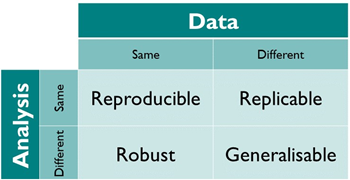

```{r setup, include=FALSE}
knitr::opts_chunk$set(echo = TRUE)
```

## Introduction

Data science is a burgeoning and yet still nascent field. Its popularity has created an influx of DS' from an incredible array of disparate backgrounds; economics to biochemistry, and all fields in between! In fact, its quite likely that DS as a profession contains more generalist skilled individuals than any other scientific career, not least because of the variety of skills required to be proficient, but also due to the fields novelty - I think it reasonable to posit that most, current, established DS were either joining from a second career and/or received no formal pedagogy/taught themselves autodidacticly. 

A generalist background clearly has merits, especially in the arena of data scientific work where a wide ranging skillset is absolutely necessary. However, the lack of pedagogical standardisation has caused problems with readability, reproducibility, and replicability. Interestingly, lacking pedagogical standardisation has not obviously inhibited the "output" of DS work from improving. Indeed, the widely recognised tools of data scientists (statistics, AI, coding, problem solving) have enjoyed rising competency and improvements, likely through a convergence in the lessons taught by both online and degree courses, and replicating pedagogy related to these skills from other disciplines. 

However, how can we actually know that improvements in Data Scientists' output have been accrued? A definition of improvements would be required, and is beyond this the scope of this brief piece, but I think it's safe to assume that most definitions would include one or more of the following: more output (perhaps in a shorter timeframe), better performing models, more appropriate figures and statistical analyses. But none of these determine whether the work that went into producing the output (data collection, datasets, the code), were appropriate for the question posed. This is the crux of the matter: the "correctness" of the output cannot be objectively assessed without transparency of the code.


# Definitions: Reproducible and Replicable

Definitions of key terminology in this space is a real minefield, not least because the field you work in may determine the definition. For a full review on this topic, do read this peer-reviewed paper by [Hans Plesser (2018)].


The definitions I will be using are taken from the [Turing Way]:

- Reproducible: A result is reproducible when the same analysis steps performed on the same dataset consistently produces the same answer.

- Replicable: A result is replicable when the same analysis performed on different datasets produces qualitatively similar answers.

- Robust: A result is robust when the same dataset is subjected to different analysis workflows to answer the same research question (for example one pipeline written in R and another written in Python) and a qualitatively similar or identical answer is produced. Robust results show that the work is not dependent on the specificities of the programming language chosen to perform the analysis.

- Generalisable: Combining replicable and robust findings allow us to form generalisable results. Note that running an analysis on a different software implementation and with a different dataset does not provide generalised results. There will be many more steps to know how well the work applies to all the different aspects of the research question. Generalisation is an important step towards understanding that the result is not dependent on a particular dataset nor a particular version of the analysis pipeline.




[Hans Plesser (2018)]: https://www.frontiersin.org/articles/10.3389/fninf.2017.00076/full
[Turing Way]: https://the-turing-way.netlify.app/reproducible-research/overview/overview-definitions.html


# Reproducible code in NHS data policy

Formal courses on data science touch on reproducibility, however serious highlighting of the importance to practical Data Science appears to have been left to the individual to self-teach, or that they learn on-the-job. 

The UK government has recently published documents describing the importance of data best practices, and promoting reproducible analytic work, within the NHS. Below are links pointing to these documents, which I'll be keeping updated when new ones become available. It's definitely worth reading these documents, they're relevant to the work you do, but more importantly they will align you with current best practices. I also learned a ton from them!

- [Better, broader, safer: using health data for research and analysis - GOV.UK, April 2022]

- [Data saves lives: reshaping health and social care with data - GOV.UK, June 2022]

[Better, broader, safer: using health data for research and analysis - GOV.UK, April 2022]: https://www.gov.uk/government/publications/better-broader-safer-using-health-data-for-research-and-analysis/better-broader-safer-using-health-data-for-research-and-analysis
[Data saves lives: reshaping health and social care with data - GOV.UK, June 2022]: https://www.gov.uk/government/publications/data-saves-lives-reshaping-health-and-social-care-with-data/data-saves-lives-reshaping-health-and-social-care-with-data#how-you-can-get-involve


# The DAA

Our department have published their three year plan (2022 - 2025), which includes a section on Data Science. A revision of this document would include greater emphasis on reproducible code production, however there is a nice example of how reproducible code will aid with one of the documents objectives: **ensure ethical coding.**


Talk about NHS and novelty of moving toward taking on DS
Talk about NHS and recent papers on data
Talk about DAA and its 3 year plan - DS part in particular - say that in order to do this are code needs to be up to scratch

Talk about ways we can work in a reproducible way as a team
Use stuff on my website to help with this